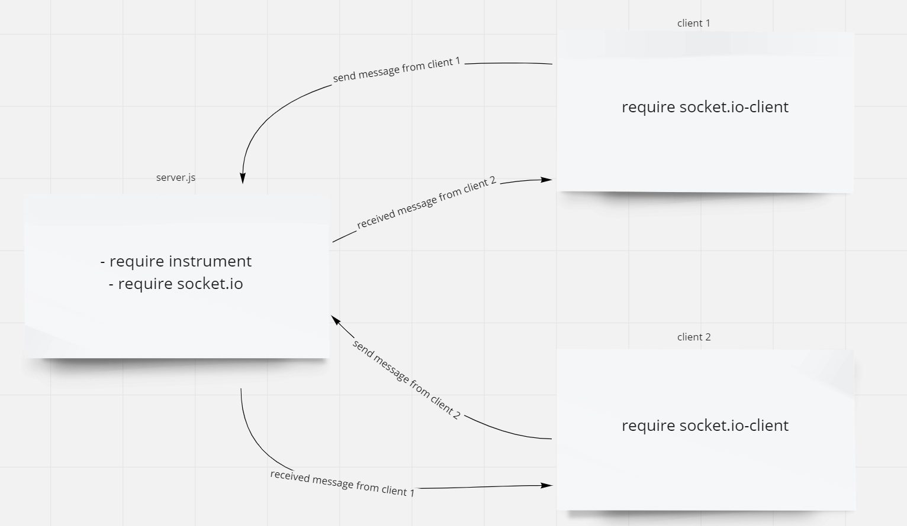

# Message-Queues

# Desicrption

Make application to contact client with eachothers use messages like messanger , I use here socket.io and socket.io-client to link between server and clients

# UML 

# links 

- [pull request](https://github.com/WalidAlrefai/Message-Queues/pull/1)